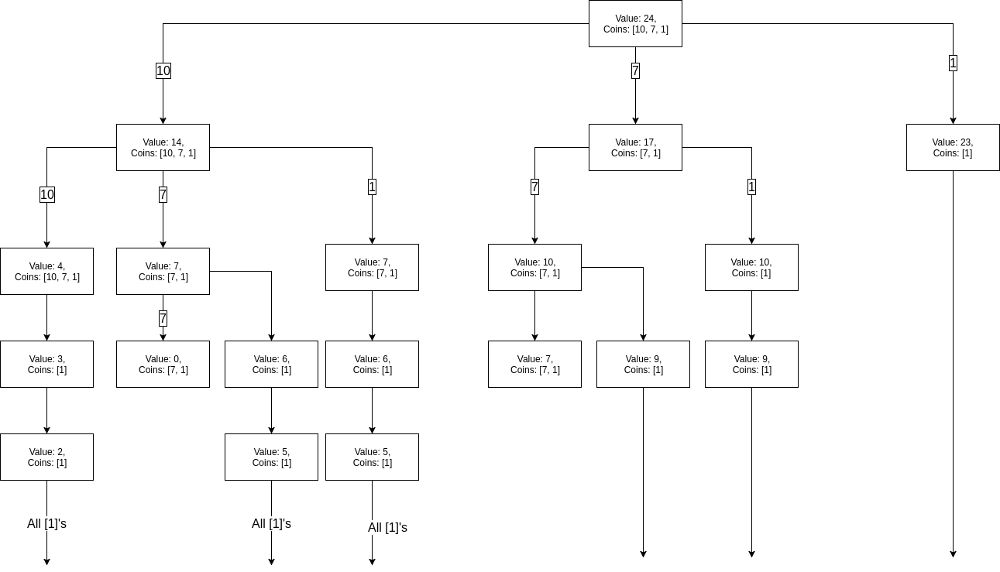

# Backtracking
In recursion, we solve a big problem by first breaking it into smaller sub problems. And then those sub problems will be broken down to *sub*-sub problems until a point at which we hit the base case. In other words, we are composing a big solution using small solutions.

However, sometimes you don't really want all the sub-solutions because some sub-solutions don't add to an optimal final solution. In this case, we need backtracking to help us weeding out the *bad* sub-solutions.

## Eight Queens
The n-queens can be solved recursively by noticing that solving eight-queens problems is equivalent to solving a seven-queens problem plus placing the 8th queen in place.

However, there are many ways of solving a seven-queens problem on a 8x8 board, not all the sub-solutions are going to allow us to place a 8th queen on the board.

Thus, we need to use backtracking to rule out all the incorrect sub-solutions or dead-ends.

#### Implementation
Given a `n` by `n` board, we have `n` columns. We will place the queen from left to right, from first column to the last column. We iterate from first row to last row and seek a valid position to place the queen

```ruby
def seek_solution(board)
    return board if board.is_solved?
    col = board.queen_count
    (0...board.size).each do |row|
        if board.is_pos_valid?(row, col)
            # Logic ...
        end
    end
    false
end
```

The algorithm begins at 0th column because we start with 0 queen. The recursive call to proceed to column 1, 2, 3, and so forth. When we detect a valid position on the board, we will go ahead and place the queen there.

``` ruby
new_board = board.dup
new_board.place_queen(row, col)
solution = seek_solution(new_board)
```

Then we recursively call `seek_solution` on the new board. Here comes the magic of backtracking, we check if the solution exists, if so, we return it! Otherwise we move on to next one

``` ruby
return solution if solution
```

The complete solution
``` ruby
def seek_solution(board)
    return board if board.is_solved?
    col = board.queen_count
    (0...board.size).each do |row|
        if board.is_pos_valid?(row, col)
            new_board = board.dup
            new_board.place_queen(row, col)
            solution = seek_solution(new_board)
            return solution if solution
        end
    end
    false
end
```

## Sudoku

## Make Change

#### The Function Call Tree


